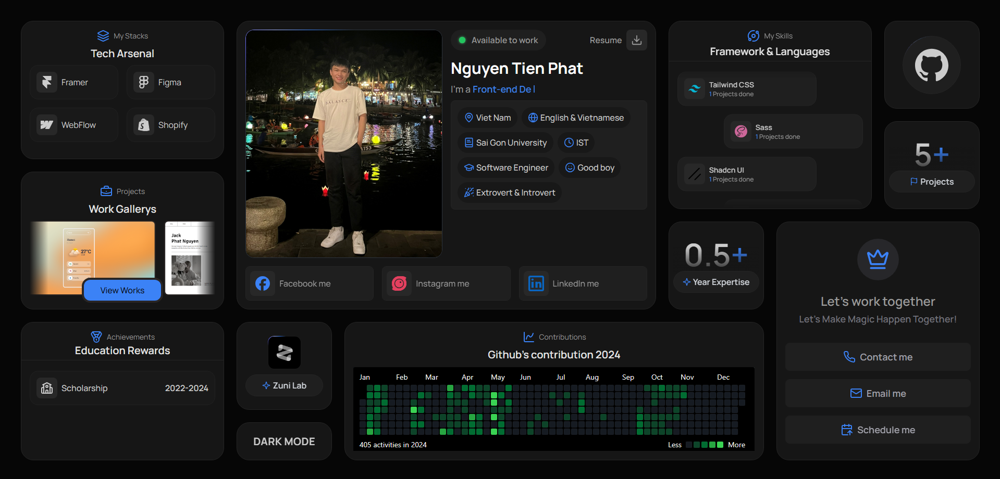

# TODO APP

## Project Description:
This portfolio serves as a digital resume and showcase of my front-end development projects. Each project page includes interactive elements built with Bento UI and ShadCN/UI to give a clear sense of each project’s goals, challenges, and solutions. Optimized for readability and ease of use, the portfolio reflects my attention to detail and passion for creating visually appealing, functional websites.
## Tech Stack Used:
```bash
    * React
    * TailwindSS
```

## [Project Link]([portfolio-one-wheat-99.vercel.app](portfolio-one-wheat-99.vercel.app))

## Screens
Home Page                   |                  
:---------------------------------:  

### Make sure to star the repository if you find it helpful!
<a href="https://github.com/Quynh-Linh-IT/To-Do-Note-Application-Website/stargazers"></a>